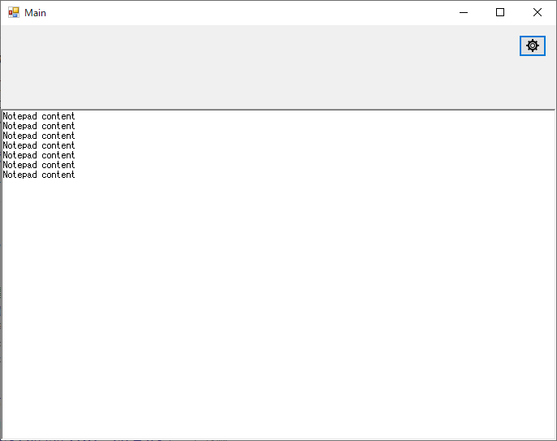

## VisualStudioアプリテンプレート

VBによるWindowsアプリ作成時のテンプレート

主な機能

 - 共有設定及び設定値をローカルXMLファイルに保存
 - 別スレッドの呼び出し及び処理結果のメインへの引き渡し
 - Windows上のアプリとのメッセージ送受信（メモ帳の例）

### 複製手順

初期化

 - プロジェクトのフォルダ全体をコピー
 - 既存のGitフォルダの削除

プロジェクト名の変更

 - ソリューションの名前変更
 - プロジェクトの名前変更
 - プロジェクトのプロパティよりアセンブリ名／ルート名前空間の変更
 - 必要に応じてアセンブリ情報を編集
 - 必要に応じてMain.Designerを編集

フォルダ構成の変更

 - 全体フォルダの名前変更
 - project.slnのプロジェクトパスの変更
 - プロジェクトメインフォルダの名前変更
 - ビルドして確認

Git設定

 - リモートに空のプロジェクト作成
 - ソリューションエクスプローラ「ソリューションをソース管理に追加」を実行
 - 同期して展開

